# Tokens

> Track, visualize, and compete on AI coding-assistant token usage — across Claude Code, Codex, Cursor, OpenCode, Gemini, and more.

> [!NOTE]
> **This project is a fork and secondary development of [Tokscale](https://github.com/junhoyeo/tokscale) by [Junho Yeo](https://github.com/junhoyeo)** (original site: [tokscale.ai](https://tokscale.ai)).
> All credit for the original design and implementation goes to the upstream author and contributors. Like the original, this project is released under the **MIT License** — see [LICENSE](./LICENSE).

**Tokens** is a CLI + web leaderboard for monitoring your AI coding token usage and cost. Install the CLI, sign in once, and your usage submits automatically — then see your stats, contribution graph, and rank at **[tokens.ci](https://tokens.ci)**.

## Install

**One-off, any platform (no install — Bun or Node 18+):**

```sh
bunx tokens-cli --help            # or: npx tokens-cli --help
bunx tokens-cli submit            # run a one-shot submit
```

**Persistent global install:**

```sh
bun add -g tokens-cli             # or: npm install -g tokens-cli
tokens --help                     # the package exposes a `tokens` command on PATH
```

The `tokens-cli` package is a thin launcher that pulls in the matching native binary for your platform (`tokens-cli-<platform>`), so a single install works everywhere and exposes the `tokens` command.

**macOS (Homebrew):**

```sh
brew install owo-network/brew/tokens
```

**Linux (one-click — installs the binary and a background service):**

```sh
curl -fsSL https://s.ee/tokens | bash
```

## Automatic submission

Sign in once, then let `tokens` submit your usage in the background on an interval (default 30 min — override with `TOKENS_SUBMIT_INTERVAL`).

**macOS:**

```sh
tokens login                 # one-time sign in with GitHub
brew services start tokens   # start the background submitter (and at login)
tokens status                # verify auth, device, and background service state
```

That's it — your usage now submits automatically. You can also submit once, manually, at any time:

```sh
tokens submit
```

**Linux (systemd, set up by `install.sh`):**

```sh
tokens login                         # one-time sign in
systemctl --user start tokens        # start the background submitter
systemctl --user enable tokens       # start automatically on boot …
sudo loginctl enable-linger "$USER"  # … even without an active login session
```

Logs: `journalctl --user -u tokens -f` · Service status: `systemctl --user status tokens` · Local check: `tokens status`

## Usage

| Command | What it does |
| --- | --- |
| `tokens` | Interactive TUI dashboard of your token usage |
| `tokens login` | Sign in with GitHub (one-time) |
| `tokens status` | Check local auth, device, and background service state |
| `tokens submit` | Submit your usage to [tokens.ci](https://tokens.ci) |
| `tokens serve` | Run the background submitter (used by the service above) |
| `tokens graph` | Export your contribution data as JSON |
| `tokens --help` | Full command reference |

## Overview

**Tokens** helps you monitor and analyze your token consumption from:

| Logo | Client | Data Location | Supported |
|------|----------|---------------|-----------|
|  | [OpenCode](https://github.com/sst/opencode) | `~/.local/share/opencode/opencode.db` (1.2+, all channels including `opencode-stable.db`) or/and `~/.local/share/opencode/storage/message/` (legacy/unmigrated) | ✅ Yes |
|  | [Claude Code](https://docs.anthropic.com/en/docs/claude-code) | `~/.claude/projects/` and `~/.claude/transcripts/` | ✅ Yes |
| 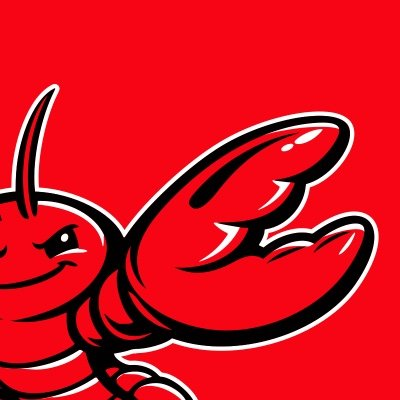 | [OpenClaw](https://openclaw.ai/) | `~/.openclaw/agents/` (+ legacy: `.clawdbot`, `.moltbot`, `.moldbot`) | ✅ Yes |
| 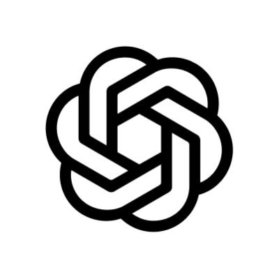 | [Codex CLI](https://github.com/openai/codex) | `~/.codex/sessions/` | ✅ Yes |
| 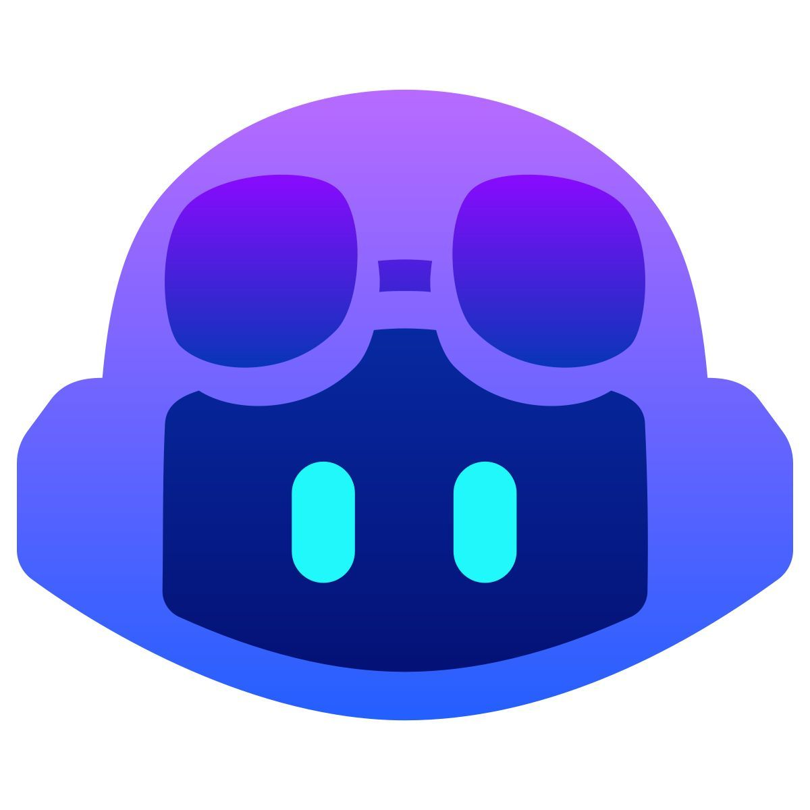 | [GitHub Copilot CLI](https://docs.github.com/en/copilot/how-tos/use-copilot-agents/use-the-github-copilot-coding-agent-in-cli) | `~/.copilot/otel/*.jsonl` (+ `COPILOT_OTEL_FILE_EXPORTER_PATH`) | ✅ Yes |
|  | [Hermes Agent](https://github.com/NousResearch/hermes-agent) | `$HERMES_HOME/state.db` (fallback: `~/.hermes/state.db`) | ✅ Yes |
| 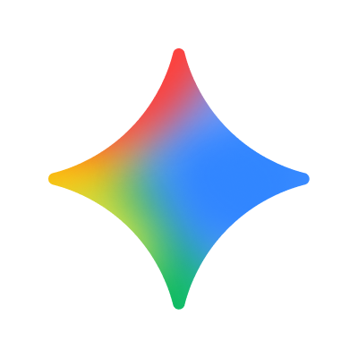 | [Gemini CLI](https://github.com/google-gemini/gemini-cli) | `$GEMINI_CLI_HOME/tmp/*/chats/*.json` (fallback: `~/.gemini/tmp/*/chats/*.json`) | ✅ Yes |
|  | [Cursor IDE](https://cursor.com/) | Cursor API export cached at `~/.config/tokens/cursor-cache/usage*.csv` (not `~/.cursor`) | ✅ Yes |
| 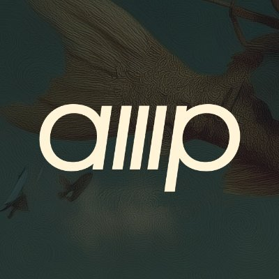 | [Amp (AmpCode)](https://ampcode.com/) | `~/.local/share/amp/threads/` | ✅ Yes |
| 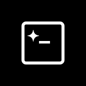 | [Codebuff](https://codebuff.com/) | `~/.config/manicode/` (+ `manicode-dev`, `manicode-staging`; override via `CODEBUFF_DATA_DIR`) | ✅ Yes |
|  | [Droid (Factory Droid)](https://factory.ai/) | `~/.factory/sessions/` | ✅ Yes |
|  | [Pi](https://github.com/badlogic/pi-mono) | `~/.pi/agent/sessions/` and `~/.omp/agent/sessions/` ([Oh My Pi](https://github.com/can1357/oh-my-pi)) | ✅ Yes |
| 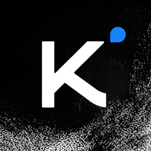 | [Kimi CLI](https://github.com/MoonshotAI/kimi-cli) | `~/.kimi/sessions/` | ✅ Yes |
| 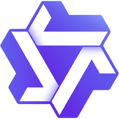 | [Qwen CLI](https://github.com/QwenLM/qwen-cli) | `~/.qwen/projects/` | ✅ Yes |
| 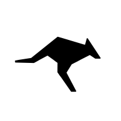 | [Roo Code](https://github.com/RooCodeInc/Roo-Code) | `~/.config/Code/User/globalStorage/rooveterinaryinc.roo-cline/tasks/` (+ server: `~/.vscode-server/data/User/globalStorage/rooveterinaryinc.roo-cline/tasks/`) | ✅ Yes |
|  | [Kilo](https://github.com/Kilo-Org/kilocode) | `~/.config/Code/User/globalStorage/kilocode.kilo-code/tasks/` (+ server: `~/.vscode-server/data/User/globalStorage/kilocode.kilo-code/tasks/`) | ✅ Yes |
|  | [Kilo CLI](https://github.com/nicepkg/kilo) | `~/.local/share/kilo/kilo.db` | ✅ Yes |
|  | [Mux](https://github.com/coder/mux) | `~/.mux/sessions/` | ✅ Yes |
| 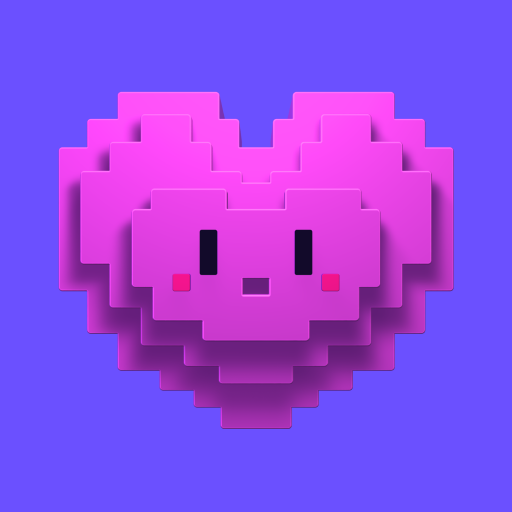 | [Crush](https://crush.ai/) | `$XDG_DATA_HOME/crush/projects.json` (project registry; fallback: `~/.local/share/crush/projects.json`) | ✅ Yes |
|  | [Goose](https://github.com/aaif-goose/goose) | `~/.local/share/goose/sessions/sessions.db` (+ macOS Application Support, legacy Block/goose paths; override via `GOOSE_PATH_ROOT`) | ✅ Yes |
| 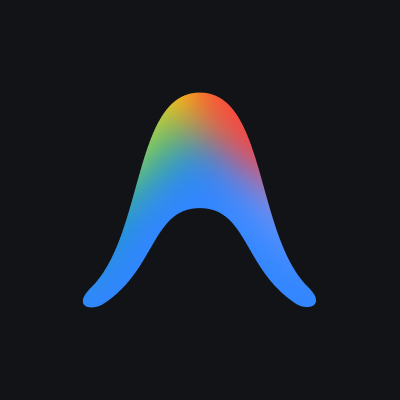 | [Google Antigravity](https://antigravity.google/) | Cached via `tokens antigravity sync` to `~/.config/tokens/antigravity-cache/sessions/*.jsonl` (live RPC against the local language server) | ✅ Yes |
|  | [Trae IDE](https://www.trae.ai/) / [Trae Solo](https://www.trae.ai/solo) (international) | Cached via `tokens trae sync` to `~/.config/tokens/trae-cache/sessions/*.json` (account-level usage from the official API) | ✅ Yes |
| Warp/Oz | [Warp](https://www.warp.dev/) / Oz | Cached via `tokens warp sync` to `~/.config/tokens/warp-cache/usage.json` (aggregate requests and spend only; no token transcripts) | ✅ Yes |
| 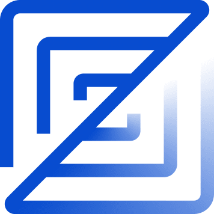 | [Zed Agent](https://zed.dev/docs/ai/agent-panel) | `~/.local/share/zed/threads/threads.db` (macOS: `~/Library/Application Support/Zed/threads/threads.db`; Windows: `%LOCALAPPDATA%/Zed/threads/threads.db`; hosted Zed models only, not external ACP agents) | ✅ Yes |
| Kiro | Kiro | `~/.kiro/sessions/cli/*.json` (+ `*.jsonl`) and `~/.local/share/kiro-cli/data.sqlite3` (macOS: `~/Library/Application Support/kiro-cli/data.sqlite3`) | ✅ Yes |
|  | [Cline](https://github.com/cline/cline) | VS Code globalStorage tasks (Linux: `~/.config/Code/...`; macOS: `~/Library/Application Support/Code/...`; Windows: `%APPDATA%\Code\...`; server: `~/.vscode-server/data/User/globalStorage/saoudrizwan.claude-dev/tasks/`) | ✅ Yes |
|  | [Synthetic](https://synthetic.new/) | Re-attributed from other sources via `hf:` model prefix or `synthetic` provider (+ [Octofriend](https://github.com/synthetic-lab/octofriend): `~/.local/share/octofriend/sqlite.db`) | ✅ Yes |

Get real-time pricing calculations using [🚅 LiteLLM's pricing data](https://github.com/BerriAI/litellm), with support for tiered pricing models and cache token discounts.

All usage is read **locally** from each tool's own data directory — nothing leaves your machine unless you run `tokens submit` or enable the background service.

## Web

- **Leaderboard & profiles:** [tokens.ci](https://tokens.ci)
- **Your profile:** `https://tokens.ci/u/<your-github-username>`
- **Settings → Submission History:** review what you've submitted, per device.

## License

[MIT](./LICENSE) — the same license as the upstream project.

Built on **[Tokscale](https://github.com/junhoyeo/tokscale)** by [Junho Yeo](https://github.com/junhoyeo). Huge thanks to the original author and contributors for the foundational work.
