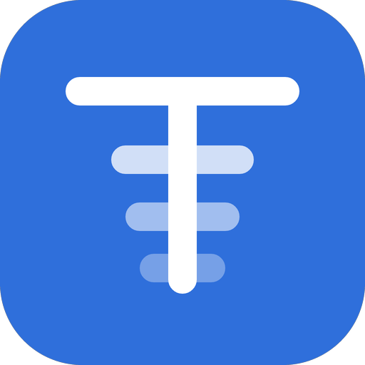
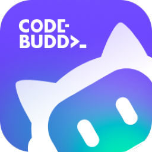
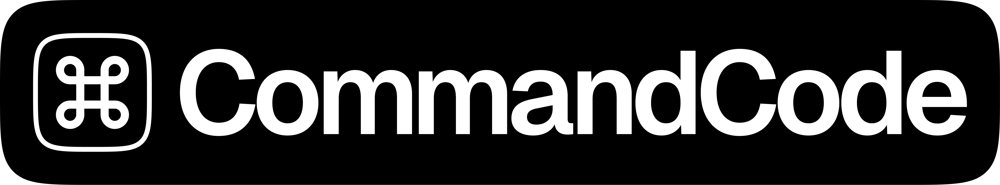
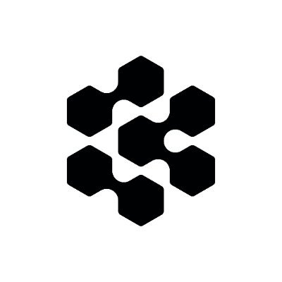
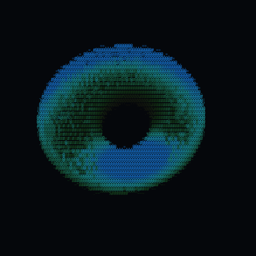
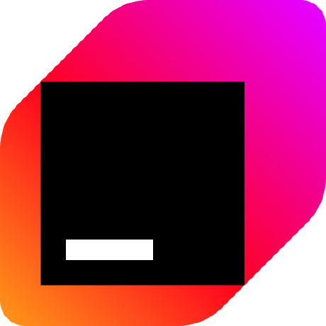
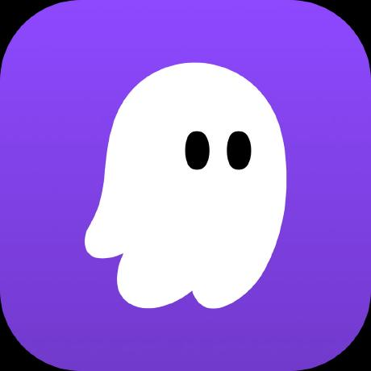
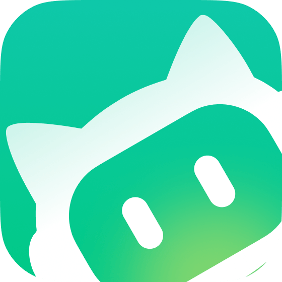
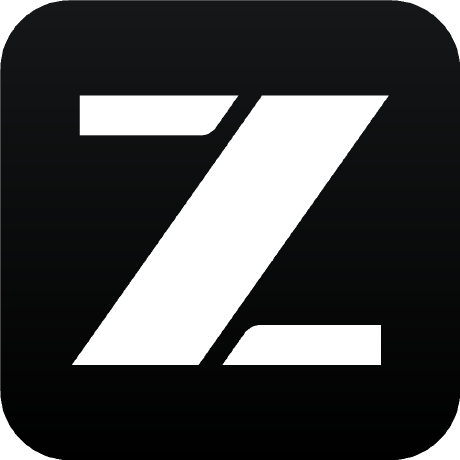

<div align="center">
  
  <h1>Tokens</h1>
  <p><strong>The leaderboard for AI coding usage.</strong></p>
  <p>
    <a href="https://tokens.ci/leaderboard">Leaderboard</a> ·
    <a href="https://tokens.ci/docs">Docs</a> ·
    <a href="https://tokens.ci/shame">Hall of Shame</a>
  </p>
</div>

---

You already burn tokens all day. **[tokens.ci](https://tokens.ci)** turns that into
a public standing: how much you ran through today, how it splits across clients
and models, and where you rank against everyone else doing the same thing.

```sh
bunx tokens-cli@latest login
```

## iOS app

<a href="https://testflight.apple.com/join/NWmvqqTX">
  
</a>

Your rank and usage on your phone, without opening a browser — share cards
rendered on device, plus Home screen and Lock screen widgets for the day's
tokens, your running total and your rank.

There is no sign-in. You enter a GitHub username and the app reads that public
profile, so enter your own or the widgets will show someone else's usage.

## Why this repository is public

So you can check what we send.

The CLI reads the session files your AI clients already write to disk, totals
them locally, and uploads **only the totals** — token counts, model names,
client names, timestamps. Prompts, completions, file contents and paths never
leave your machine.

You do not have to take that on faith. The whole pipeline is here:

- `cli/tokens-core/src/sessions/` — one parser per client, showing exactly which
  fields are read out of each session file
- `cli/tokens-core/src/aggregator.rs` — how those reads become daily totals
- `cli/tokens-cli/src/commands/` — the submit path, including the exact payload

`tokens submit --dry-run` prints what would be uploaded without uploading it.

We are not asking anyone to run their own copy. This repo exists to be read.

## Supported clients

All 41 are detected automatically — if it is installed and has
written sessions, it is counted.

|  |  |  |  |
|---|---|---|---|
|  Amp |  Antigravity |  Antigravity CLI |  Claude Code |
|  Cline |  CodeBuddy |  Codebuff |  Codex CLI |
|  Command Code |  Copilot |  Crush |  Cursor |
|  Devin CLI |  Devin Desktop |  Droid |  Fx |  Gajae Code |
|  Gemini CLI |  Goose |  Grok Build |  Hermes Agent |
|  Jcode |  Junie |  Kilo |  Kilo CLI |
|  Kimi |  Kiro |  MiMo Code |  Mux |
|  OpenClaw |  OpenCode |  OpenCodeReview |  Orca |
|  Pi |  Qwen |  Reasonix |  Roo Code |
|  Trae |   |   |   |
|  Warp |  WorkBuddy |  ZCode |  Zed Agent |

<details>
<summary>Where each one stores its data</summary>

| Client | Data location |
|---|---|
| [Claude Code](https://docs.anthropic.com/en/docs/claude-code) | `~/.claude/projects/`, `~/.claude/transcripts/` |
| [Codex CLI](https://github.com/openai/codex) | `~/.codex/sessions/` |
| [OpenCode](https://github.com/sst/opencode) | `~/.local/share/opencode/opencode.db` (1.2+) or `~/.local/share/opencode/storage/message/` |
| [Cursor](https://cursor.com/) | API export cached at `~/.config/tokens/cursor-cache/usage*.csv` |
| [Copilot CLI](https://docs.github.com/en/copilot) | `~/.copilot/otel/*.jsonl` |
| [Gemini CLI](https://github.com/google-gemini/gemini-cli) | `~/.gemini/tmp/*/chats/*.json` |
| [Kimi CLI](https://github.com/MoonshotAI/kimi-cli) | `~/.kimi/sessions/` |
| [Qwen CLI](https://github.com/QwenLM/qwen-cli) | `~/.qwen/projects/` |
| Reasonix | `~/.reasonix/stats/*.jsonl` (override via `REASONIX_STATE_HOME` or `REASONIX_HOME`) |
| [Amp](https://ampcode.com/) | `~/.local/share/amp/threads/` |
| [Droid](https://factory.ai/) | `~/.factory/sessions/` |
| [Cline](https://github.com/cline/cline) | VS Code globalStorage tasks, or `~/.cline/data/sessions/` for the Cline CLI / desktop |
| [Roo Code](https://github.com/RooCodeInc/Roo-Code) | VS Code globalStorage tasks |
| [Kilo](https://github.com/Kilo-Org/kilocode) | VS Code globalStorage tasks |
| [Kilo CLI](https://github.com/nicepkg/kilo) | `~/.local/share/kilo/kilo.db` |
| [Crush](https://crush.ai/) | `$XDG_DATA_HOME/crush/projects.json` |
| [Goose](https://github.com/aaif-goose/goose) | `~/.local/share/goose/sessions/sessions.db` |
| [Mux](https://github.com/coder/mux) | `~/.mux/sessions/` |
| [Pi](https://github.com/badlogic/pi-mono) | `~/.pi/agent/sessions/`, `~/.omp/agent/sessions/` |
| [Zed Agent](https://zed.dev/docs/ai/agent-panel) | `~/.local/share/zed/threads/threads.db` |
| Kiro | `~/.kiro/sessions/cli/`, `~/.local/share/kiro-cli/data.sqlite3` |
| [Warp](https://www.warp.dev/) / Oz | `tokens warp sync` → `~/.config/tokens/warp-cache/usage.json` |
| [Trae](https://www.trae.ai/) | `tokens trae sync` → `~/.config/tokens/trae-cache/sessions/` |
| [Antigravity](https://antigravity.google/) | `tokens antigravity sync` → `~/.config/tokens/antigravity-cache/sessions/` |
| [OpenClaw](https://openclaw.ai/) | `~/.openclaw/agents/` |
| [Codebuff](https://codebuff.com/) | `~/.config/manicode/` |
| [Hermes](https://github.com/NousResearch/hermes-agent) | `$HERMES_HOME/state.db` |
| [Synthetic](https://synthetic.new/) | Re-attributed via `hf:` model prefix or `synthetic` provider |
| [Fx](https://github.com/vercel-labs/fx) | `~/.fx/sessions/<sessionId>/usage-v2.json` (per-session aggregates) |

</details>

Clients that expose usage only through an account API need a sync step first —
`tokens cursor sync`, `tokens antigravity sync`, `tokens trae sync`,
`tokens warp sync` — after which they submit like everything else.

Pricing comes from a combination of
[LiteLLM](https://github.com/BerriAI/litellm),
[OpenRouter](https://openrouter.ai) and
[models.dev](https://github.com/anomalyco/models.dev),
with the best matching rate used per model. Built-in overrides handle tiered
rates and cache discounts where the upstream feeds do not.

## What makes it different

**One number, across everything.** Most usage tools are scoped to a single
client. This one merges every client you run into one total, deduplicated per
client-day, so switching from Claude Code to Codex mid-afternoon does not split
your day into two half-stories.

**Built to be gamed against.** A public leaderboard attracts inflated numbers.
Submissions are checked for cross-device duplicates and monotonic regressions,
accounts caught faking totals are banned, and the bans are public in the
[Hall of Shame](https://tokens.ci/shame). Ranking is worth nothing if nobody
polices it.

**A profile worth linking.** Your page carries a verified badge if your GitHub
account has at least two social links, your split by client and model, your
contribution graph, and embeddable SVG cards for a README — ten templates, both
themes, rendered server-side.

**Small on your machine.** The CLI is one job: scan, total, submit. It runs as a
background service and otherwise stays out of the way.

## Differences from Tokscale

This project is a fork of [Tokscale](https://github.com/junhoyeo/tokscale). The
data-collection core is shared and we keep pulling upstream's parser, pricing
and correctness fixes. Everything above that has diverged:

| | Tokscale | Tokens |
|---|---|---|
| CLI surface | Full TUI dashboard plus report commands (`models`, `monthly`, `hourly`, `graph`, `wrapped`, `pricing`, …) | Submit only — `login`, `submit`, `serve`, `status`. The TUI and every report command are removed, ~11k lines and 15 dependencies with them |
| Reporting | In the terminal | On the web, where it can be linked and compared |
| Anti-cheat | — | Cross-device duplicate guard, resubmit monotonicity checks, account bans, public Hall of Shame |
| Identity | Username | Verified badge from GitHub social links, refreshed daily |
| Groups | Team/group leaderboards | Removed — one global ranking |
| Frontend | Upstream's components | Rebuilt on shadcn/ui with its own brand marks and per-page Open Graph cards |

**Upstream sync policy:** data capabilities and correctness fixes come in; UI
implementations do not. The site keeps its own component set so the design stays
consistent across updates.

## Install

**macOS**

```sh
brew install owo-network/brew/tokens
tokens login
brew services start tokens        # keeps submitting in the background
```

**Linux**

```sh
curl -fsSL https://tokens.ci/install.sh | sh
tokens login
```

The installer sets up a systemd user service, so submission keeps running after
you close the terminal.

**Windows, or a one-off anywhere** (Bun or Node 18+)

```sh
bunx tokens-cli@latest login      # or: npx tokens-cli@latest login
bunx tokens-cli@latest submit
```

## Who pays for this

<div align="center">
  <a href="https://neon.com">
    
  </a>
  <p><strong><a href="https://neon.com">Neon</a></strong> sponsor the Postgres behind <a href="https://tokens.ci">tokens.ci</a>.</p>
</div>

Tokens is free to use and free to self-host, and the leaderboard reads each page
from Postgres rather than from a cache of a cache. That is what keeps the numbers
honest, and it is also the expensive way to do it. Neon cover that cost, so the
board does not have to go behind a paywall or get thinner to fit a budget.

## License

MIT — see [LICENSE](./LICENSE).

Built on [Tokscale](https://github.com/junhoyeo/tokscale) by
[Junho Yeo](https://github.com/junhoyeo); credit for the original design and
implementation goes to the upstream author and contributors.
